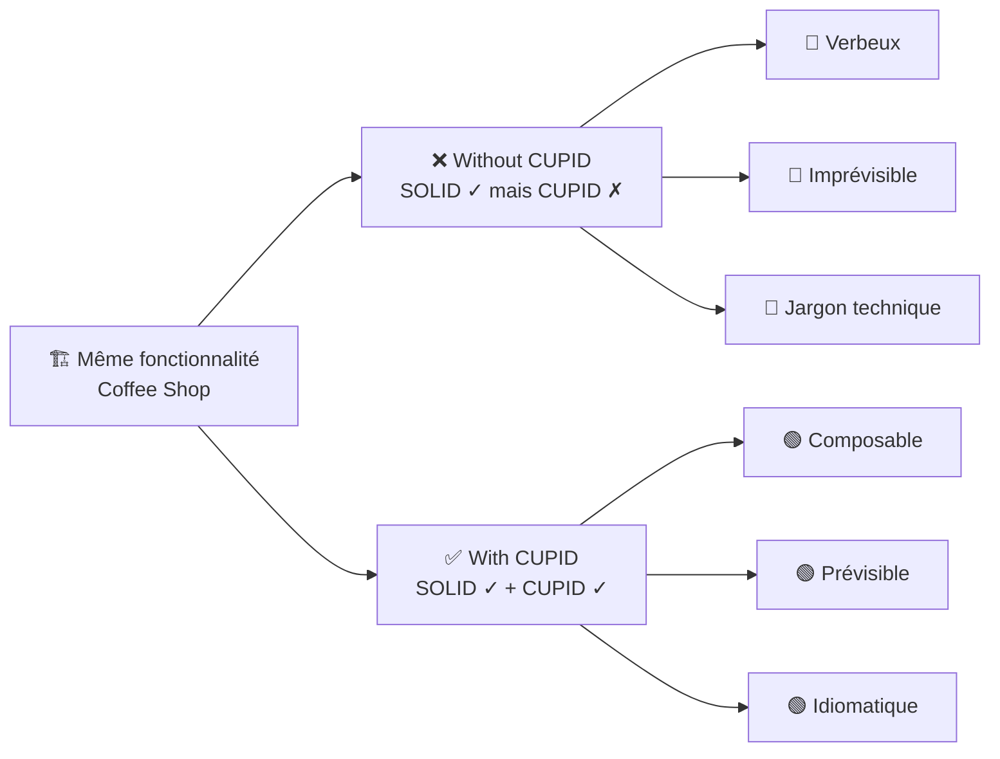
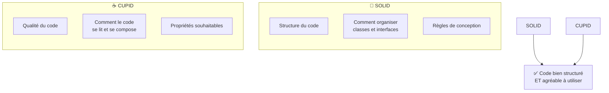
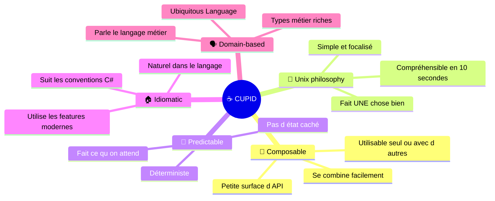
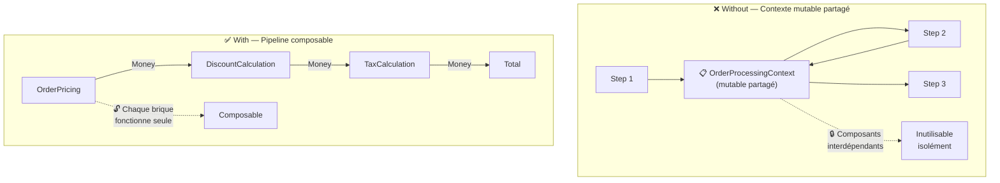
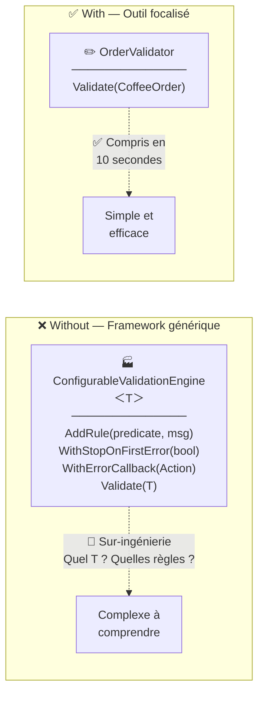
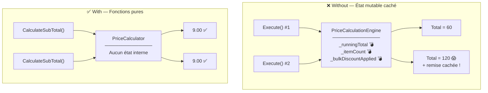
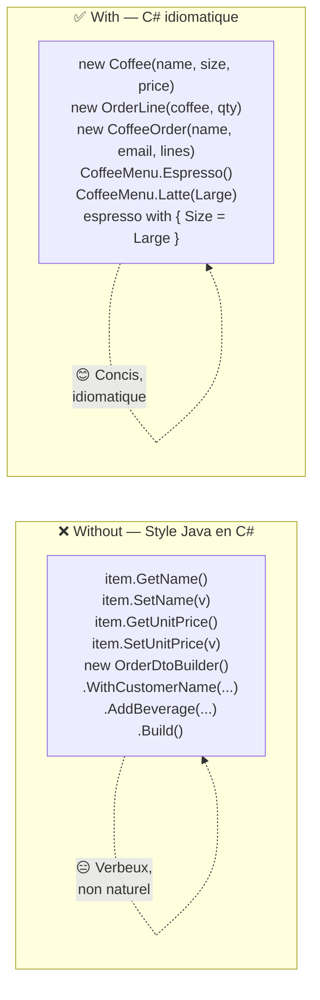
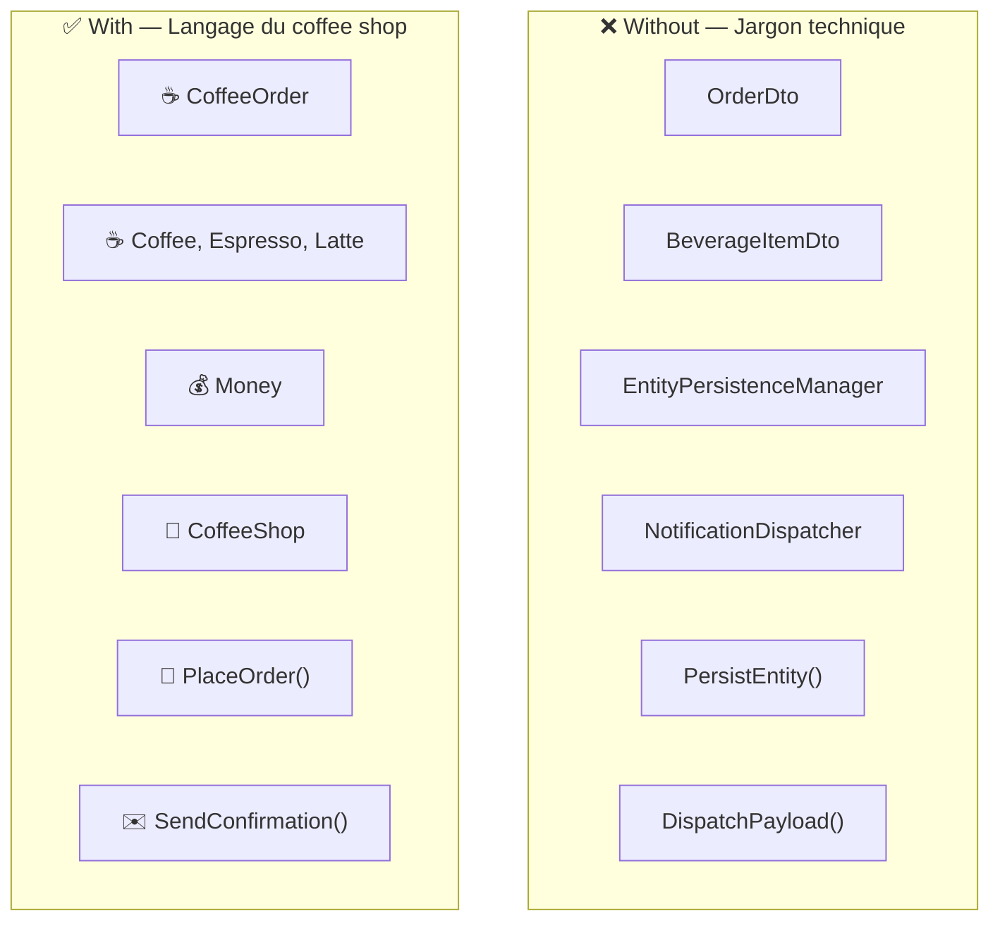
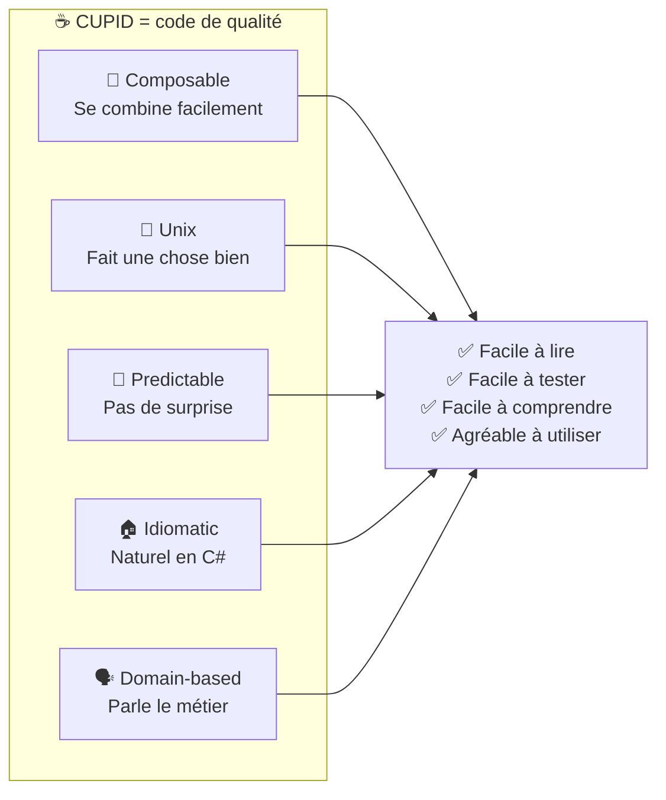

# ☕ SoftwareCraftLab — CUPID en C#

> **Laboratoire pratique** pour comprendre et démontrer l'intérêt des **propriétés CUPID** (Daniel Terhorst-North) en C# / .NET 10.

## 🎯 But du projet

Ce projet propose **deux implémentations de la même fonctionnalité** (un système de commandes pour un coffee shop) :

| Dossier | Contenu | Objectif |
|---|---|---|
| `Without/` | Code **SOLID** mais **sans** CUPID | Montrer que SOLID seul ne suffit pas |
| `With/` | Code **SOLID + CUPID** | Montrer ce que CUPID apporte en plus |

> ⚠️ **Point clé** : le code `Without` respecte **SOLID** (interfaces, DI, SRP…).
> Il montre qu'on peut avoir du code bien structuré mais **désagréable à utiliser**.
> CUPID ajoute les qualités qui rendent le code **agréable à lire, tester et comprendre**.



## 💡 SOLID vs CUPID : complémentaires, pas concurrents



## 📁 Structure du projet

```
CUPID/
├── With/                                  ✅ SOLID + CUPID
│   ├── Sources/Cupid.With/
│   │   ├── Models/
│   │   │   ├── CoffeeSize.cs             🗣️ Enum métier
│   │   │   ├── Money.cs                   🏠 Value Object idiomatique avec opérateurs
│   │   │   └── CoffeeOrder.cs            🗣️ Coffee, OrderLine, CoffeeOrder, OrderConfirmation
│   │   ├── Composable/Pricing.cs          🧩 OrderPricing, TaxCalculation, DiscountCalculation
│   │   ├── Unix/OrderValidator.cs         🔧 Fait UNE chose bien
│   │   ├── Predictable/PriceCalculator.cs 🔮 Fonctions pures, pas d'état
│   │   ├── Idiomatic/CoffeeMenu.cs        🏠 API naturelle C# avec pattern matching
│   │   └── Domain/CoffeeShop.cs           🗣️ Façade métier + IOrderStore, IConfirmationNotifier
│   └── Tests/Cupid.With.Tests/            🧪 38 tests
│
└── Without/                               ❌ SOLID ✓ mais CUPID ✗
    ├── Sources/Cupid.Without/
    │   ├── Models/OrderDto.cs             🗣️✗ DTO anémique, accesseurs Java
    │   ├── Composable/OrderOrchestrator.cs 🧩✗ Contexte mutable partagé
    │   ├── Unix/ConfigurableValidationEngine.cs 🔧✗ Framework sur-ingénié
    │   ├── Predictable/PriceCalculationEngine.cs 🔮✗ État caché, non déterministe
    │   ├── Idiomatic/OrderDtoBuilder.cs    🏠✗ Builder Java-style
    │   └── Domain/Services.cs             🗣️✗ EntityPersistenceManager, NotificationDispatcher
    └── Tests/Cupid.Without.Tests/         🧪 19 tests
```

---

## 🧭 Les 5 propriétés CUPID



---

### 🧩 C — Composable

> *« Le code se combine facilement avec d'autres briques. Petite surface d'API, entrée → sortie. »*



| | ❌ Without (SOLID ✓) | ✅ With (SOLID + CUPID) |
|---|---|---|
| **Communication** | Contexte mutable partagé (`OrderProcessingContext`) | Chaque brique prend un `Money` et renvoie un `Money` |
| **Isolation** | Impossible d'utiliser une étape sans le contexte complet | Chaque composant utilisable seul ou composé |
| **Ordre** | L'ordre des étapes change le résultat (notification avant calcul → `total = 0`) | Pipeline naturel, chaque sortie = entrée suivante |

**Anti-pattern illustré** — Le contexte mutable partagé :

```csharp
// ❌ Without — Les étapes mutent un contexte partagé
public class OrderProcessingContext
{
    public required OrderDto Order { get; set; }
    public decimal SubTotal { get; set; }        // 💣 muté par Step 1
    public decimal TaxAmount { get; set; }        // 💣 muté par Step 2
    public decimal FinalTotal { get; set; }       // 💣 muté par Step 3
    public List<string> Logs { get; } = [];       // 💣 muté par tous
}

var context = new OrderProcessingContext { Order = order };
foreach (var step in steps)
    step.Execute(context); // Chaque step mute context 😰
```

**Bonne pratique** — Pipeline d'entrée/sortie :

```csharp
// ✅ With — Chaque brique prend un Money et renvoie un Money
var subTotal = pricing.CalculateSubTotal(order.Lines);  // Money → Money
var discounted = discount.ApplyDiscount(subTotal);       // Money → Money
var tax = taxCalc.CalculateTax(discounted);              // Money → Money
var total = discounted + tax;                            // 🧩 Composable !
```

---

### 🔧 U — Unix Philosophy

> *« Fait UNE chose, bien, complètement. Compréhensible en 10 secondes. »*



| | ❌ Without (SOLID ✓) | ✅ With (SOLID + CUPID) |
|---|---|---|
| **Portée** | `ConfigurableValidationEngine<T>` — valide n'importe quoi | `OrderValidator` — valide des commandes de café |
| **Clarté** | Il faut lire la configuration pour comprendre | Le nom suffit |
| **Usage** | Configurer, ajouter des règles, puis valider | Appeler `Validate(order)` |

**Anti-pattern illustré** — Le framework sur-ingénié :

```csharp
// ❌ Without — Framework à configurer avant usage
var engine = new ConfigurableValidationEngine<OrderDto>()
    .AddRule(o => !string.IsNullOrWhiteSpace(o.GetCustomerEmail()), "Email requis")
    .AddRule(o => o.GetItems().Count > 0, "Articles requis")
    .WithStopOnFirstError(true);
var result = engine.Validate(order); // 🏭 Usine à gaz
```

**Bonne pratique** — Fait une chose, bien :

```csharp
// ✅ With — Fait UNE chose, bien
var result = validator.Validate(order); // 🔧 C'est tout !
```

---

### 🔮 P — Predictable

> *« Fait ce qu'on attend. Même entrée → même sortie. Pas d'état caché. »*



| | ❌ Without (SOLID ✓) | ✅ With (SOLID + CUPID) |
|---|---|---|
| **État** | `_runningTotal` s'accumule entre les appels | Aucun état interne |
| **Déterminisme** | Appeler 2 fois = résultat doublé 😱 | Appeler 100 fois = même résultat ✅ |
| **Surprises** | Remise volume cachée au-delà de 5 articles | Tous les paramètres sont explicites |

**Anti-pattern illustré** — L'état caché :

```csharp
// ❌ Without — État caché, résultat imprévisible
public class PriceCalculationEngine : IOrderProcessingStep
{
    private decimal _runningTotal;          // 💣 s'accumule !
    private int _itemCount;                 // 💣 s'accumule !
    private bool _bulkDiscountApplied;      // 💣 remise surprise !

    public void Execute(OrderProcessingContext context)
    {
        foreach (var item in context.Order.GetItems())
        {
            _runningTotal += item.GetUnitPrice() * item.GetQuantity();
            _itemCount += item.GetQuantity();
        }

        // Remise cachée — rien ne l'annonce dans la signature !
        if (_itemCount >= 5 && !_bulkDiscountApplied)
        {
            _runningTotal *= 0.9m;
            _bulkDiscountApplied = true;
        }

        context.SubTotal = _runningTotal;
    }
}

engine.Execute(context);  // SubTotal = 60
engine.Execute(context);  // SubTotal = 120 😱 (accumulé !)
```

**Bonne pratique** — Fonctions pures :

```csharp
// ✅ With — Fonction pure, toujours le même résultat
public class PriceCalculator
{
    public Money CalculateSubTotal(IReadOnlyList<OrderLine> lines) =>
        lines.Aggregate(Money.Zero, (sum, line) => sum + line.LineTotal);

    public Money CalculateTax(Money subTotal, decimal taxRate) =>
        subTotal * taxRate;
}

calculator.CalculateSubTotal(lines);  // 9.00
calculator.CalculateSubTotal(lines);  // 9.00 ✅ (même entrée = même sortie)
```

---

### 🏠 I — Idiomatic

> *« Naturel dans le langage. Un développeur C# lit le code et se dit : "c'est comme ça que j'aurais fait." »*



| | ❌ Without (SOLID ✓) | ✅ With (SOLID + CUPID) |
|---|---|---|
| **Modèles** | Classes mutables, getters/setters Java | Records immuables, constructeurs primaires |
| **Construction** | Builder Java-style verbeux | Constructeur record + `with` expressions |
| **API** | `item.GetName()`, `item.SetName(v)` | `item.Name` (propriété C#) |
| **Opérateurs** | Pas utilisés | `price * qty`, `subtotal + tax` (surcharge naturelle) |
| **Types** | `decimal` pour l'argent | `Money` — Value Object avec opérateurs |

**Anti-pattern illustré** — Le Builder Java en C# :

```csharp
// ❌ Without — Verbeux, style Java
var order = new OrderDtoBuilder()
    .WithCustomerName("Alice")
    .WithCustomerEmail("alice@coffee.com")
    .AddBeverage("Latte", 4.00m, 2, "Medium")
    .Build();

// Accesseurs Java-style
string name = order.GetCustomerName();  // 😑
order.SetCustomerEmail("new@mail.com"); // 😑
```

**Bonne pratique** — C# idiomatique :

```csharp
// ✅ With — Concis, idiomatique C#
var order = new CoffeeOrder("Alice", "alice@coffee.com",
    [CoffeeMenu.OrderLine(CoffeeMenu.Latte(), 2)]);

// Records immuables, propriétés naturelles
string name = order.CustomerName;           // 😊
var bigger = espresso with { Size = Large }; // 😊

// Value Object Money avec opérateurs
var total = subTotal + tax;                  // 😊
var lineTotal = coffee.Price * quantity;     // 😊
```

---

### 🗣️ D — Domain-based

> *« Le code parle le langage du métier. Un expert du domaine reconnaît les concepts. »*



| | ❌ Without (SOLID ✓) | ✅ With (SOLID + CUPID) |
|---|---|---|
| **Modèle** | `OrderDto`, `BeverageItemDto` | `CoffeeOrder`, `Coffee`, `OrderLine` |
| **Façade** | `OrderOrchestrator` | `CoffeeShop` |
| **Actions** | `PersistEntity()`, `DispatchPayload()` | `PlaceOrder()`, `SaveOrder()`, `SendConfirmation()` |
| **Types** | `decimal` pour l'argent | `Money` — Value Object métier |
| **Vocabulaire** | Technique (DTO, Entity, Payload, Endpoint) | Métier (Coffee, Latte, Espresso, Small, Large) |

**Anti-pattern illustré** — Jargon technique :

```csharp
// ❌ Without — Un barista ne comprend pas ce code
public class EntityPersistenceManager : IOrderProcessingStep
{
    public void Execute(OrderProcessingContext context)
    {
        _dataStore.Add(
            $"Entity persisted: customer={context.Order.GetCustomerEmail()}, total={context.SubTotal}");
    }
}

public class NotificationDispatcher : IOrderProcessingStep
{
    public void Execute(OrderProcessingContext context)
    {
        _dispatchedPayloads.Add(
            $"Payload dispatched to endpoint: {context.Order.GetCustomerEmail()}");
    }
}
```

**Bonne pratique** — Langage métier :

```csharp
// ✅ With — Un barista comprend ce code
public class CoffeeShop(
    OrderValidator validator,
    OrderPricing pricing,
    TaxCalculation tax,
    IOrderStore store,
    IConfirmationNotifier notifier)
{
    public OrderConfirmation PlaceOrder(CoffeeOrder order)
    {
        var subTotal = pricing.CalculateSubTotal(order.Lines);
        var taxAmount = tax.CalculateTax(subTotal);
        var total = subTotal + taxAmount;

        var confirmation = new OrderConfirmation(order, subTotal, taxAmount, total);
        store.SaveOrder(confirmation);           // 📝 Verbe métier
        notifier.SendConfirmation(confirmation); // ✉️ Verbe métier
        return confirmation;
    }
}
```

---

## 📊 Récapitulatif CUPID



| Propriété | ❌ Without (SOLID ✓) | ✅ With (SOLID + CUPID) |
|---|---|---|
| 🧩 **Composable** | Contexte mutable partagé → couplage | Pipeline Money → Money → composable |
| 🔧 **Unix** | Framework générique sur-ingénié | Validateur focalisé, compris en 10s |
| 🔮 **Predictable** | État caché, résultat doublé au 2e appel | Fonctions pures, déterministes |
| 🏠 **Idiomatic** | Builder Java, getters/setters manuels | Records, opérateurs, pattern matching |
| 🗣️ **Domain** | DTO, Entity, Payload, Dispatcher | Coffee, Money, PlaceOrder, CoffeeShop |

---

## 🧪 Lancer les tests

```bash
dotnet test
```

> **57 tests** — 38 pour `With` (SOLID + CUPID) + 19 pour `Without` (SOLID ✓ CUPID ✗).

Les tests du projet `Without` montrent les **limites** d'un code SOLID sans CUPID :
- 🔴 État caché qui s'accumule entre les appels (Predictable ✗)
- 🔴 Contexte mutable partagé — composants non utilisables isolément (Composable ✗)
- 🔴 Sur-ingénierie : framework générique à configurer (Unix ✗)
- 🔴 Builder Java verbeux, getters/setters manuels (Idiomatic ✗)
- 🔴 Nommage technique : DTO, Entity, Payload (Domain ✗)

Les tests du projet `With` montrent les **avantages** de CUPID :
- 🟢 Fonctions pures testables sans setup complexe (Predictable ✓)
- 🟢 Chaque brique testable isolément ou en composition (Composable ✓)
- 🟢 API simple et directe, pas de configuration (Unix ✓)
- 🟢 Records immuables, opérateurs naturels (Idiomatic ✓)
- 🟢 Le code raconte l'histoire métier (Domain ✓)

---

## 🛠️ Technologies

- **.NET 10** / **C# 14**
- **xUnit** pour les tests
- Aucune dépendance externe — tout le code est autonome

## 📄 Licence

Projet à vocation pédagogique — libre d'utilisation.
