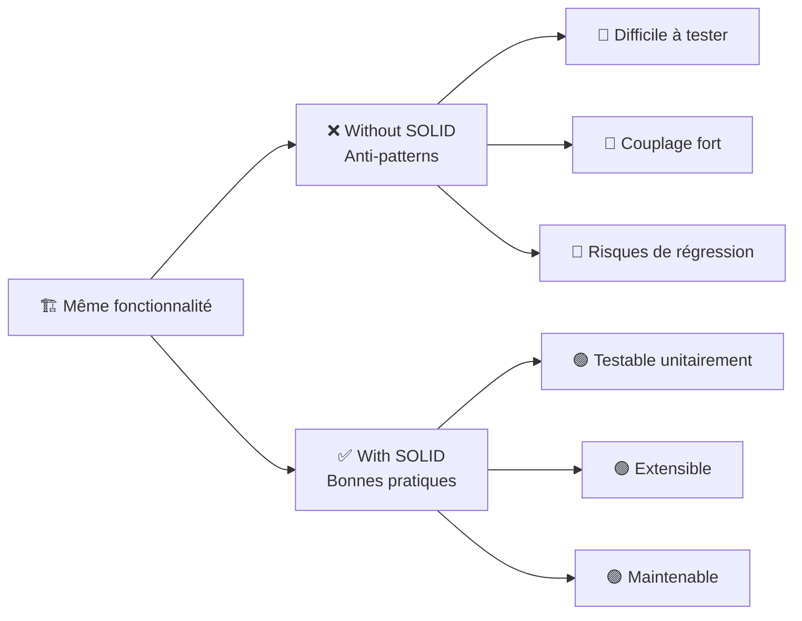
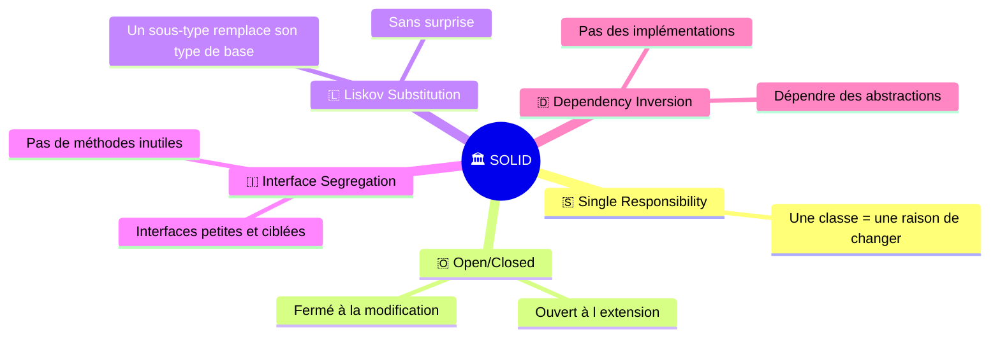
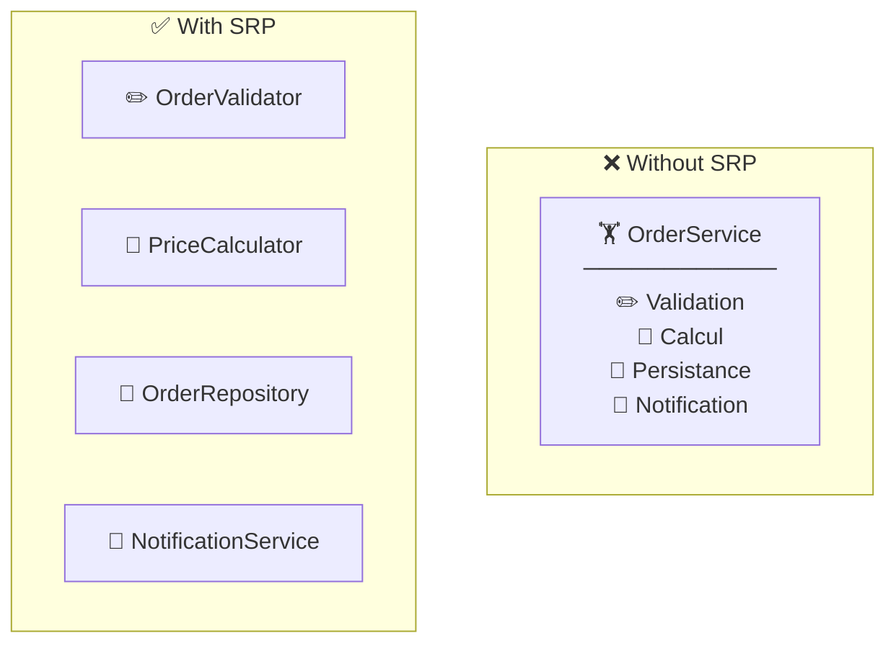
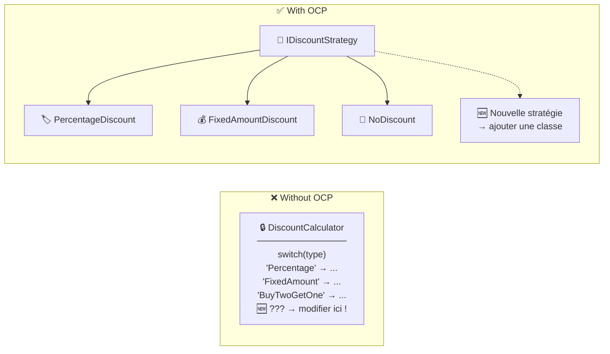
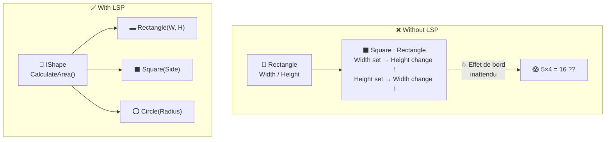
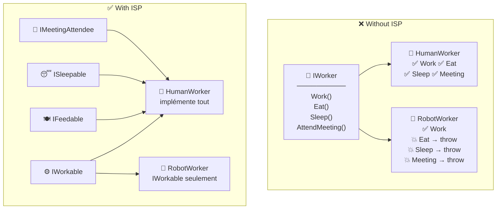
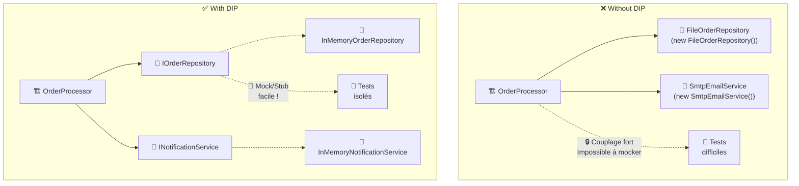
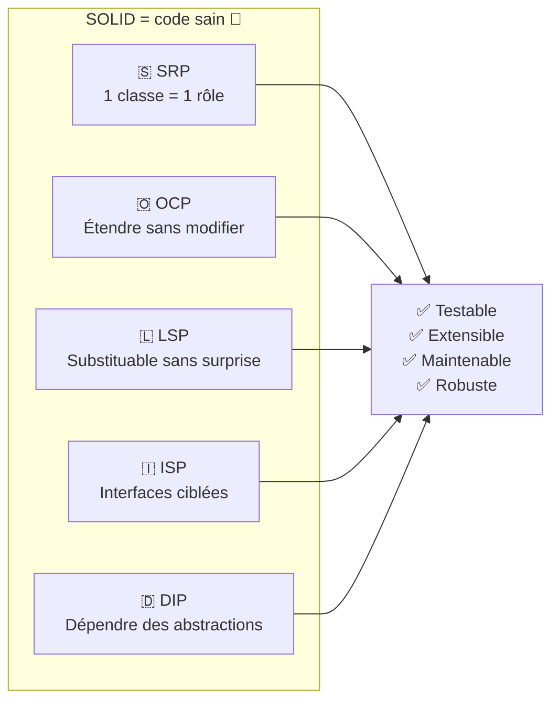

# 🧪 SoftwareCraftLab — C#

> **Laboratoire pratique** pour comprendre et démontrer l'intérêt des **principes SOLID** en C# / .NET 10.

## 🎯 But du projet

Ce projet propose **deux implémentations de la même fonctionnalité** (un système de traitement de commandes) :

| Dossier | Contenu | Objectif |
|---|---|---|
| `Without/` | Code **sans** SOLID (anti-patterns) | Montrer les problèmes concrets |
| `With/` | Code **avec** SOLID (bonnes pratiques) | Montrer les solutions apportées |

En comparant les deux côte à côte, on voit clairement **pourquoi** SOLID rend le code plus testable, extensible et maintenable.



## 📁 Structure du projet

```
SOLID/
├── With/                          ✅ Respecte SOLID
│   ├── Sources/Solid.With/
│   │   ├── Models/                📦 Modèles partagés (Order, OrderItem)
│   │   ├── Srp/                   1️⃣ Responsabilité unique
│   │   ├── Ocp/                   2️⃣ Ouvert/Fermé
│   │   ├── Lsp/                   3️⃣ Substitution de Liskov
│   │   ├── Isp/                   4️⃣ Ségrégation des interfaces
│   │   └── Dip/                   5️⃣ Inversion des dépendances
│   └── Tests/SolidWithTests/      🧪 32 tests
│
└── Without/                       ❌ Viole SOLID
    ├── Sources/Solid.Without/
    │   ├── Models/                📦 Mêmes modèles
    │   ├── Srp/                   1️⃣ God class
    │   ├── Ocp/                   2️⃣ Switch fermé
    │   ├── Lsp/                   3️⃣ Rectangle/Square piégeux
    │   ├── Isp/                   4️⃣ Interface fourre-tout
    │   └── Dip/                   5️⃣ Dépendances en dur
    └── Tests/SolidWithoutTests/   🧪 22 tests
```

---

## 📐 Les 5 principes SOLID



---

### 1️⃣ S — Single Responsibility Principle (SRP)

> *« Une classe ne doit avoir qu'une seule raison de changer. »*



| | ❌ Without | ✅ With |
|---|---|---|
| **Fichier** | `OrderService.cs` — 1 God class | 4 classes ciblées |
| **Test** | Impossible de tester le calcul sans déclencher la persistance et la notification | Chaque classe testable **isolément** |
| **Modification** | Changer les règles de validation risque de casser la notification | Changer la validation n'impacte que `OrderValidator` |

**Anti-pattern illustré** — La God class :

```csharp
// ❌ OrderService fait TOUT dans une seule méthode
public decimal ProcessOrder(Order order)
{
    // Validation...  🏋️ Responsabilité 1
    // Calcul...      🏋️ Responsabilité 2
    // Sauvegarde...  🏋️ Responsabilité 3
    // Notification...🏋️ Responsabilité 4
}
```

**Bonne pratique** — Chaque classe a un rôle unique :

```csharp
// ✅ OrderValidator ne s'occupe QUE de la validation
public class OrderValidator
{
    public OrderValidationResult Validate(Order order) { /* ... */ }
}

// ✅ PriceCalculator ne s'occupe QUE du calcul
public class PriceCalculator
{
    public decimal CalculateTotal(Order order) { /* ... */ }
}
```

---

### 2️⃣ O — Open/Closed Principle (OCP)

> *« Ouvert à l'extension, fermé à la modification. »*



| | ❌ Without | ✅ With |
|---|---|---|
| **Ajout d'une remise** | Modifier le `switch` existant | Créer une nouvelle classe `IDiscountStrategy` |
| **Risque** | Régression sur les remises existantes | Aucun — le code existant n'est pas touché |
| **Pattern** | Switch/case fermé | Strategy Pattern |

**Anti-pattern illustré** — Le switch fermé :

```csharp
// ❌ Chaque nouvelle remise = modifier ce code
return discountType switch
{
    "Percentage"       => amount * (1 - value / 100m),
    "FixedAmount"      => Math.Max(0, amount - value),
    "BuyTwoGetOneFree" => amount * 2m / 3m,
    // 🆕 Ajouter ici → violation OCP !
    _ => amount
};
```

**Bonne pratique** — Le Strategy Pattern :

```csharp
// ✅ Interface ouverte à l'extension
public interface IDiscountStrategy
{
    decimal Apply(decimal amount);
}

// ✅ Nouvelle remise = nouvelle classe, RIEN à modifier
public class PercentageDiscount(decimal percentage) : IDiscountStrategy
{
    public decimal Apply(decimal amount) => amount * (1 - percentage / 100m);
}
```

---

### 3️⃣ L — Liskov Substitution Principle (LSP)

> *« Un sous-type doit pouvoir remplacer son type de base sans altérer le comportement attendu. »*



| | ❌ Without | ✅ With |
|---|---|---|
| **Hiérarchie** | `Square` hérite de `Rectangle` | Chaque forme implémente `IShape` |
| **Piège** | `r.Width = 5; r.Height = 4;` → Area = **16** au lieu de **20** | Records immuables, pas d'effet de bord |
| **Substitution** | ❌ Square n'est PAS substituable à Rectangle | ✅ Toutes les formes sont substituables |

**Anti-pattern illustré** — L'héritage qui trahit :

```csharp
// ❌ Square redéfinit les setters avec des effets de bord
Rectangle shape = new Square();
shape.Width = 5;
shape.Height = 4;
shape.CalculateArea(); // 💥 Renvoie 16 (4×4) au lieu de 20 (5×4)
```

**Bonne pratique** — Records immuables avec interface commune :

```csharp
// ✅ Chaque forme a sa propre représentation, pas de conflit
public record Rectangle(double Width, double Height) : IShape
{
    public double CalculateArea() => Width * Height;
}

public record Square(double Side) : IShape
{
    public double CalculateArea() => Side * Side;
}
```

---

### 4️⃣ I — Interface Segregation Principle (ISP)

> *« Aucun client ne devrait être forcé de dépendre de méthodes qu'il n'utilise pas. »*



| | ❌ Without | ✅ With |
|---|---|---|
| **Interface** | 1 grosse `IWorker` (4 méthodes) | 4 interfaces ciblées |
| **Robot** | Forcé d'implémenter `Eat()`, `Sleep()` → `NotSupportedException` | N'implémente **que** `IWorkable` |
| **Sécurité** | Erreur à l'exécution 💥 | Erreur à la compilation 🛡️ |

**Anti-pattern illustré** — L'interface fourre-tout :

```csharp
// ❌ Le robot est FORCÉ d'implémenter des méthodes non pertinentes
public class RobotWorker : IWorker
{
    public string Work() => "Le robot travaille.";
    public string Eat()  => throw new NotSupportedException(); // 💥
    public string Sleep() => throw new NotSupportedException(); // 💥
}
```

**Bonne pratique** — Interfaces ciblées :

```csharp
// ✅ Le robot n'implémente QUE ce qui le concerne
public class RobotWorker : IWorkable
{
    public string Work() => "Le robot travaille.";
    // Pas de Eat(), Sleep() → le compilateur protège !
}
```

---

### 5️⃣ D — Dependency Inversion Principle (DIP)

> *« Les modules de haut niveau ne doivent pas dépendre des modules de bas niveau. Les deux doivent dépendre d'abstractions. »*



| | ❌ Without | ✅ With |
|---|---|---|
| **Dépendances** | `new FileOrderRepository()` en dur | Injection de `IOrderRepository` |
| **Tests** | Obligé d'utiliser les vraies implémentations | Stubs/mocks injectables à volonté |
| **Changement** | Changer de BDD → modifier `OrderProcessor` | Changer de BDD → nouvelle implémentation, rien à modifier |

**Anti-pattern illustré** — Le `new` en dur :

```csharp
// ❌ OrderProcessor crée LUI-MÊME ses dépendances concrètes
public class OrderProcessor
{
    private readonly FileOrderRepository _repository = new(); // 🔒
    private readonly SmtpEmailService _emailService = new();   // 🔒
}
```

**Bonne pratique** — Injection de constructeur :

```csharp
// ✅ Dépend des abstractions, injectées de l'extérieur
public class OrderProcessor(
    IOrderRepository repository,
    INotificationService notificationService)
{
    public string Process(Order order)
    {
        repository.Save(order, total);                         // 📐 Abstraction
        notificationService.SendConfirmation(email, total);    // 📐 Abstraction
    }
}
```

---

## 🧪 Lancer les tests

```bash
dotnet test
```

> **54 tests** — 32 pour `With` (SOLID) + 22 pour `Without` (anti-patterns).

Les tests du projet `Without` montrent les **limites** des anti-patterns :
- 🔴 Impossible de tester une responsabilité isolément (SRP)
- 🔴 `NotSupportedException` à l'exécution (ISP)
- 🔴 Résultats surprenants lors de la substitution (LSP)
- 🔴 Pas de mock/stub possible (DIP)

Les tests du projet `With` montrent les **avantages** de SOLID :
- 🟢 Chaque classe testée indépendamment
- 🟢 Nouvelles stratégies ajoutées dans les tests sans modifier le code source
- 🟢 Stubs personnalisés injectés (ex : `FailingOrderRepository`)
- 🟢 Le compilateur empêche les appels invalides

---

## 📚 Résumé visuel



---

## 🛠️ Technologies

- **.NET 10** / **C# 14**
- **xUnit** pour les tests
- Aucune dépendance externe — tout le code est autonome

## 📄 Licence

Projet à vocation pédagogique — libre d'utilisation.