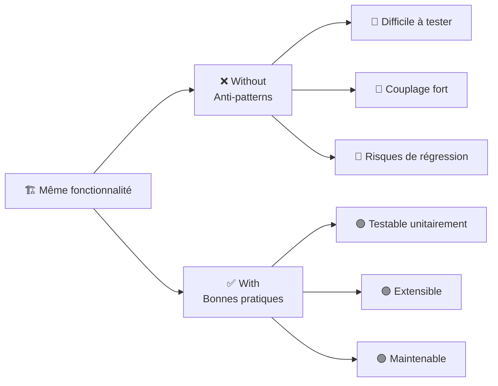
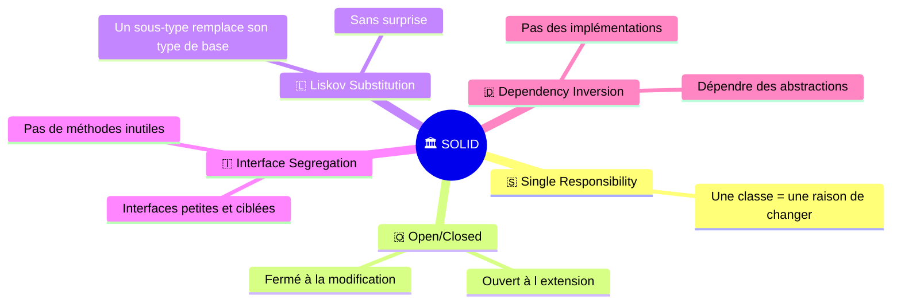
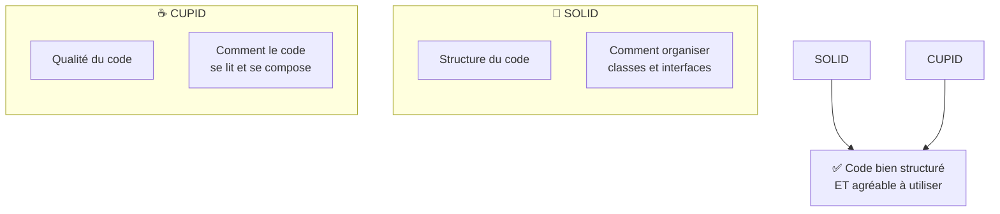
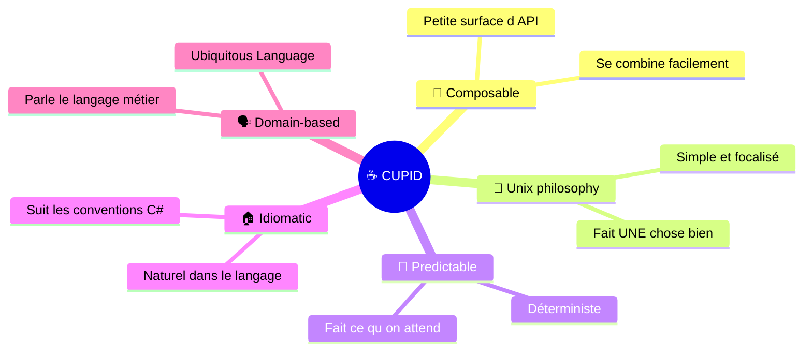
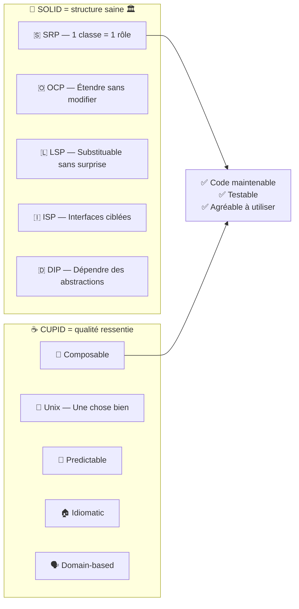

# 🧪 SoftwareCraftLab — C#

> **Laboratoire pratique** pour comprendre et démontrer l'intérêt des principes **SOLID** et des propriétés **CUPID** en C# / .NET 10.

## 🎯 But du projet

Ce projet propose, pour chaque famille de principes, **deux implémentations de la même fonctionnalité** :

| Dossier | Contenu | Objectif |
|---|---|---|
| `Without/` | Code violant les principes (anti-patterns) | Montrer les problèmes concrets |
| `With/` | Code respectant les principes | Montrer les solutions apportées |



## 📁 Structure du projet

```
CSharp/
├── SOLID/                         📐 Principes de conception orientée objet
│   ├── With/    ✅                SOLID respecté
│   ├── Without/ ❌                SOLID violé
│   └── README.FR.md              📖 Documentation détaillée SOLID
│
└── CUPID/                         ☕ Propriétés de code de qualité
    ├── With/    ✅                SOLID + CUPID
    ├── Without/ ❌                SOLID ✓ mais CUPID ✗
    └── README.FR.md              📖 Documentation détaillée CUPID
```

---

# 📐 SOLID — Principes de conception orientée objet

> Les 5 principes SOLID guident la **structure** du code orienté objet.
> 📖 **[Documentation détaillée SOLID →](SOLID/README.FR.md)**



### 🛒 Domaine : Système de commandes en ligne

| Principe | ❌ Without (anti-pattern) | ✅ With (bonne pratique) |
|---|---|---|
| **S** — SRP | `OrderService` — God class 4 responsabilités | 4 classes ciblées (Validator, Calculator, Repository, Notifier) |
| **O** — OCP | `switch` fermé — modifier pour étendre | `IDiscountStrategy` — créer une classe pour étendre |
| **L** — LSP | `Square : Rectangle` avec effets de bord | `IShape` + records immuables, substituables |
| **I** — ISP | `IWorker` impose `Eat()`/`Sleep()` au robot → `NotSupportedException` | Interfaces ciblées, le robot n'implémente que `IWorkable` |
| **D** — DIP | `new FileOrderRepository()` en dur | Injection de `IOrderRepository` — testable avec stubs |

---

# ☕ CUPID — Propriétés de code de qualité

> **CUPID** (par Daniel Terhorst-North) décrit les **propriétés** que devrait avoir un bon code.
> Là où SOLID guide la **structure**, CUPID guide la **qualité ressentie** du code.
> 📖 **[Documentation détaillée CUPID →](CUPID/README.FR.md)**



> ⚠️ **Point clé** : le dossier `CUPID/Without` contient du code **SOLID-compliant**
> (interfaces, DI, SRP…) mais qui manque de qualités CUPID. Cela montre que
> **SOLID seul ne suffit pas** pour du code vraiment agréable à utiliser.



### ☕ Domaine : Coffee Shop

| Propriété | ❌ Without (SOLID ✓ CUPID ✗) | ✅ With (SOLID + CUPID) |
|---|---|---|
| 🧩 **Composable** | Contexte mutable partagé (`OrderProcessingContext`) | Pipeline `Money → Money` — composable |
| 🔧 **Unix** | `ConfigurableValidationEngine<T>` — framework sur-ingénié | `OrderValidator` — fait une chose bien |
| 🔮 **Predictable** | `PriceCalculationEngine` — état caché, résultat doublé au 2e appel | `PriceCalculator` — fonctions pures, déterministes |
| 🏠 **Idiomatic** | Builder Java-style, getters/setters manuels | Records, opérateurs, pattern matching |
| 🗣️ **Domain** | `OrderDto`, `EntityPersistenceManager`, `DispatchPayload()` | `CoffeeOrder`, `CoffeeShop`, `PlaceOrder()` |

---

## 🧪 Lancer les tests

```bash
dotnet test
```

> **111 tests au total** — tous passent ✅
>
> | Module | With | Without | Total |
> |---|---|---|---|
> | 📐 SOLID | 29 | 25 | **54** |
> | ☕ CUPID | 38 | 19 | **57** |
> | **Total** | **67** | **44** | **111** |

---

## 📚 Résumé visuel



---

## 🛠️ Technologies

- **.NET 10** / **C# 14**
- **xUnit** pour les tests
- Aucune dépendance externe — tout le code est autonome

## 📄 Licence

Projet à vocation pédagogique — libre d'utilisation.
