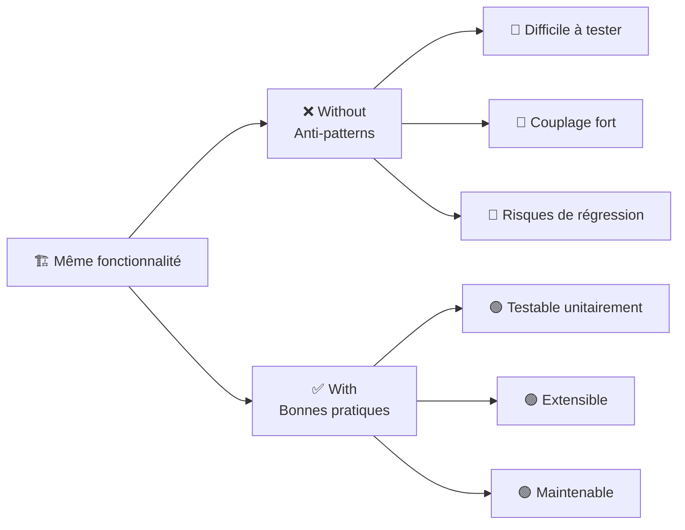
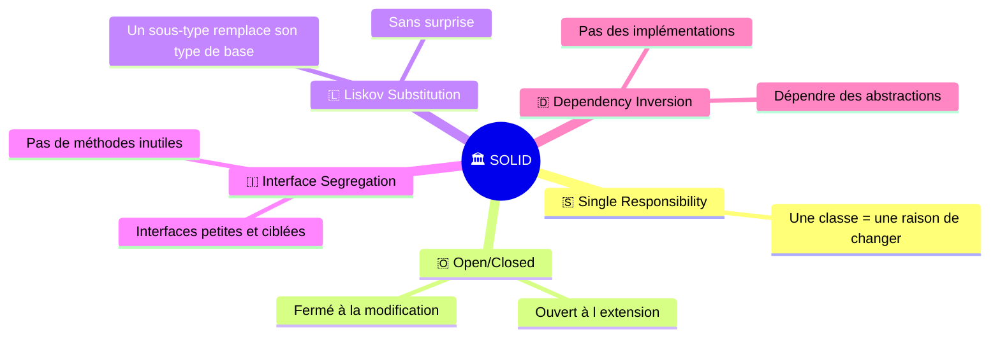
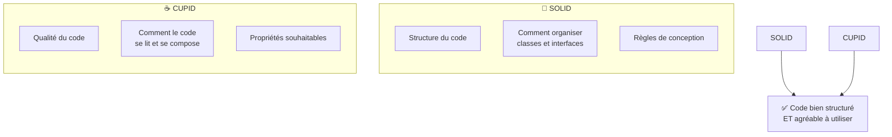
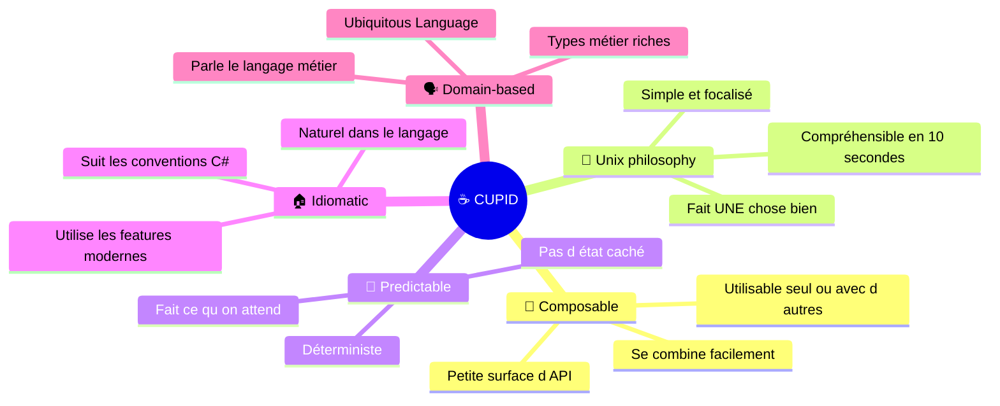
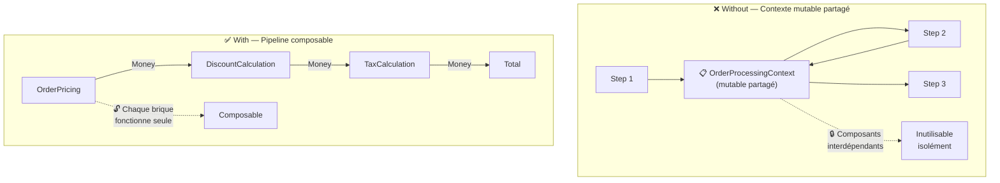
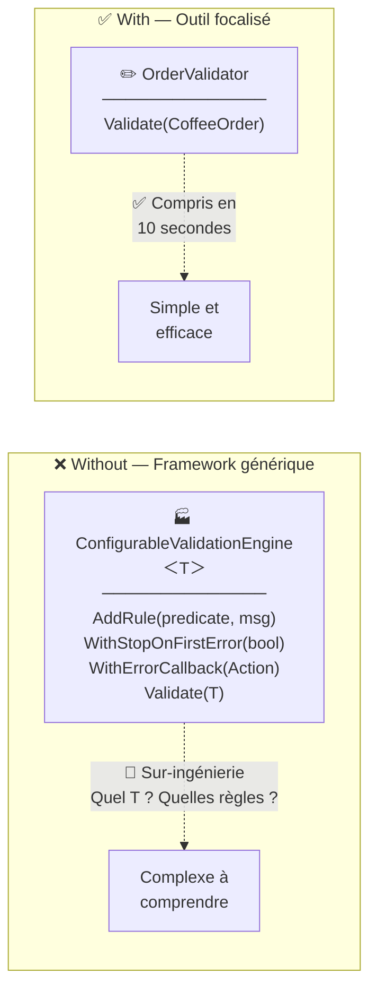
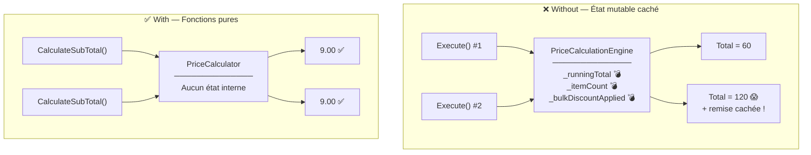
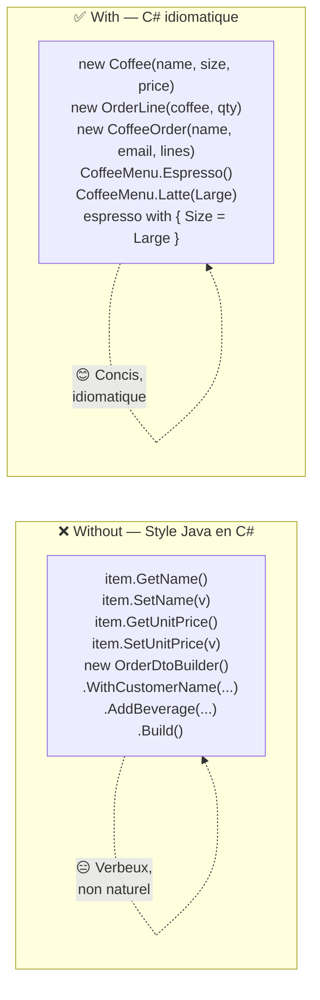
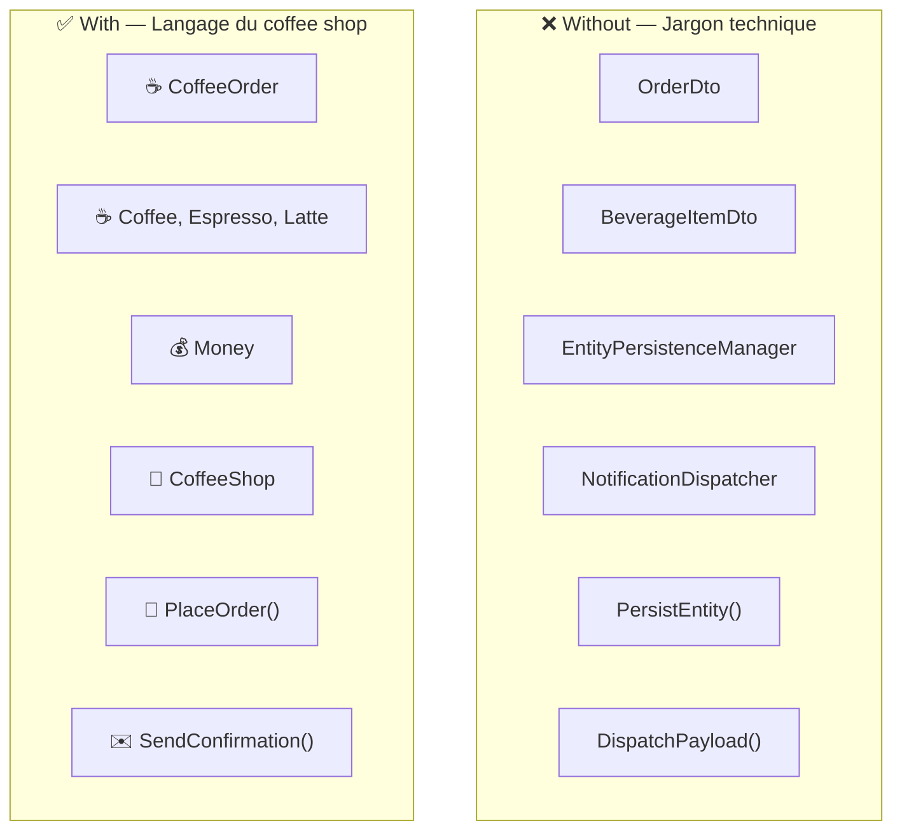
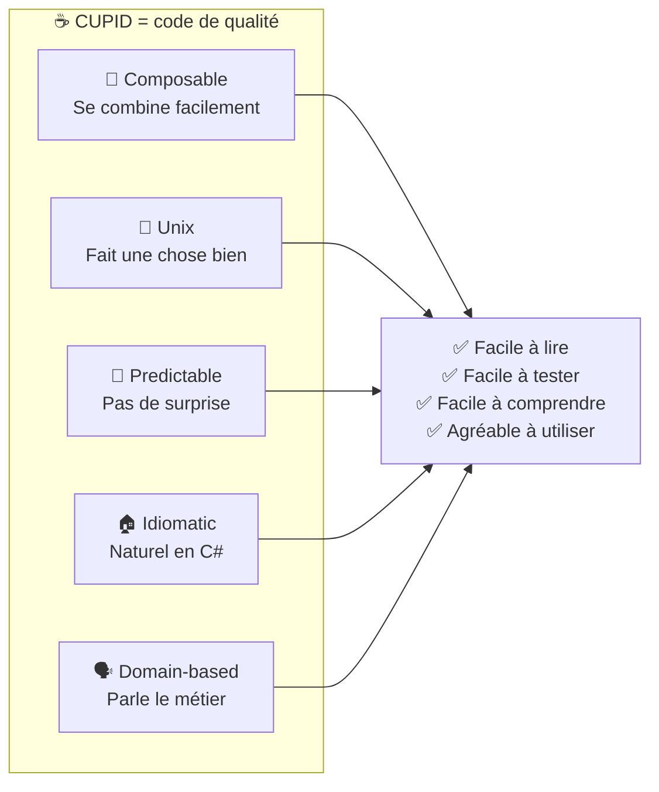

# 🧪 SoftwareCraftLab — C#

> **Laboratoire pratique** pour comprendre et démontrer l'intérêt des principes **SOLID** et **CUPID** en C# / .NET 10.

## 🎯 But du projet

Ce projet propose, pour chaque famille de principes, **deux implémentations de la même fonctionnalité** :

| Dossier | Contenu | Objectif |
|---|---|---|
| `Without/` | Code violant les principes (anti-patterns) | Montrer les problèmes concrets |
| `With/` | Code respectant les principes | Montrer les solutions apportées |



## 📁 Structure du projet

```
CSharp/
├── SOLID/                         📐 Principes de conception orientée objet
│   ├── With/    ✅                SOLID respecté
│   └── Without/ ❌                SOLID violé
│
└── CUPID/                         ☕ Propriétés de code de qualité
    ├── With/    ✅                SOLID + CUPID
    └── Without/ ❌                SOLID ✓ mais CUPID ✗
```

---

# 📐 SOLID — Principes de conception orientée objet

> Les 5 principes SOLID guident la **structure** du code orienté objet.



### 🛒 Domaine : Système de commandes en ligne

| Principe | ❌ Without (anti-pattern) | ✅ With (bonne pratique) |
|---|---|---|
| **S** — SRP | `OrderService` — God class 4 responsabilités | 4 classes ciblées (Validator, Calculator, Repository, Notifier) |
| **O** — OCP | `switch` fermé — modifier pour étendre | `IDiscountStrategy` — créer une classe pour étendre |
| **L** — LSP | `Square : Rectangle` avec effets de bord | `IShape` + records immuables, substituables |
| **I** — ISP | `IWorker` impose `Eat()`/`Sleep()` au robot → `NotSupportedException` | Interfaces ciblées, le robot n'implémente que `IWorkable` |
| **D** — DIP | `new FileOrderRepository()` en dur | Injection de `IOrderRepository` — testable avec stubs |

<details>
<summary>📂 Détail de la structure SOLID</summary>

```
SOLID/
├── With/Sources/Solid.With/
│   ├── Models/Order.cs              📦 Modèles partagés
│   ├── Srp/                         1️⃣ OrderValidator, PriceCalculator, OrderRepository, NotificationService
│   ├── Ocp/                         2️⃣ IDiscountStrategy + PercentageDiscount, FixedAmountDiscount, NoDiscount
│   ├── Lsp/                         3️⃣ IShape + Rectangle, Square, Circle (records immuables)
│   ├── Isp/                         4️⃣ IWorkable, IFeedable, ISleepable, IMeetingAttendee
│   └── Dip/                         5️⃣ IOrderRepository, INotificationService + OrderProcessor
│
└── Without/Sources/Solid.Without/
    ├── Models/Order.cs              📦 Mêmes modèles
    ├── Srp/OrderService.cs          1️⃣ God class (valide + calcule + persiste + notifie)
    ├── Ocp/DiscountCalculator.cs    2️⃣ Switch fermé
    ├── Lsp/Shapes.cs                3️⃣ Rectangle/Square avec effet de bord
    ├── Isp/Workers.cs               4️⃣ Interface fourre-tout IWorker
    └── Dip/OrderProcessor.cs        5️⃣ new FileOrderRepository(), new SmtpEmailService()
```
</details>

---

# ☕ CUPID — Propriétés de code de qualité

> **CUPID** (par Daniel Terhorst-North) décrit les **propriétés** que devrait avoir un bon code.
> Là où SOLID guide la **structure**, CUPID guide la **qualité ressentie** du code.

## 💡 SOLID vs CUPID : complémentaires, pas concurrents



> ⚠️ **Point clé du projet** : le dossier `CUPID/Without` contient du code **SOLID-compliant**
> (interfaces, DI, SRP…) mais qui manque de qualités CUPID. Cela montre que
> **SOLID seul ne suffit pas** pour du code vraiment agréable à utiliser.

## 🧭 Les 5 propriétés CUPID



### ☕ Domaine : Coffee Shop

Le code **Without** utilise un système de commandes de boissons implémenté avec SOLID (interfaces, DI, SRP) mais sans les qualités CUPID. Le code **With** implémente la même fonctionnalité en ajoutant les propriétés CUPID.

---

### 🧩 C — Composable

> *« Le code se combine facilement avec d'autres briques. Petite surface d'API, entrée → sortie. »*



| | ❌ Without (SOLID ✓) | ✅ With (SOLID + CUPID) |
|---|---|---|
| **Communication** | Contexte mutable partagé (`OrderProcessingContext`) | Chaque brique prend un `Money` et renvoie un `Money` |
| **Isolation** | Impossible d'utiliser une étape sans le contexte complet | Chaque composant utilisable seul ou composé |
| **Ordre** | L'ordre des étapes change le résultat (notification avant calcul → `total = 0`) | Pipeline naturel, chaque sortie = entrée suivante |

```csharp
// ❌ Without — Les étapes mutent un contexte partagé
var context = new OrderProcessingContext { Order = order };
foreach (var step in steps)
    step.Execute(context); // Chaque step mute context 😰

// ✅ With — Pipeline d'entrée/sortie, composable
var subTotal = pricing.CalculateSubTotal(order.Lines);  // Money → Money
var discounted = discount.ApplyDiscount(subTotal);       // Money → Money
var tax = taxCalc.CalculateTax(discounted);              // Money → Money
var total = discounted + tax;                            // 🧩 Composable !
```

---

### 🔧 U — Unix Philosophy

> *« Fait UNE chose, bien, complètement. Compréhensible en 10 secondes. »*



| | ❌ Without (SOLID ✓) | ✅ With (SOLID + CUPID) |
|---|---|---|
| **Portée** | `ConfigurableValidationEngine<T>` — valide n'importe quoi | `OrderValidator` — valide des commandes de café |
| **Clarté** | Il faut lire la configuration pour comprendre | Le nom suffit |
| **Usage** | Configurer, ajouter des règles, puis valider | Appeler `Validate(order)` |

```csharp
// ❌ Without — Framework à configurer avant usage
var engine = new ConfigurableValidationEngine<OrderDto>()
    .AddRule(o => !string.IsNullOrWhiteSpace(o.GetCustomerEmail()), "Email requis")
    .AddRule(o => o.GetItems().Count > 0, "Articles requis")
    .WithStopOnFirstError(true);
var result = engine.Validate(order); // 🏭 Usine à gaz

// ✅ With — Fait UNE chose, bien
var result = validator.Validate(order); // 🔧 C'est tout !
```

---

### 🔮 P — Predictable

> *« Fait ce qu'on attend. Même entrée → même sortie. Pas d'état caché. »*



| | ❌ Without (SOLID ✓) | ✅ With (SOLID + CUPID) |
|---|---|---|
| **État** | `_runningTotal` s'accumule entre les appels | Aucun état interne |
| **Déterminisme** | Appeler 2 fois = résultat doublé 😱 | Appeler 100 fois = même résultat ✅ |
| **Surprises** | Remise volume cachée au-delà de 5 articles | Tous les paramètres sont explicites |

```csharp
// ❌ Without — État caché, résultat imprévisible
engine.Execute(context);  // SubTotal = 60
engine.Execute(context);  // SubTotal = 120 😱 (accumulé !)

// ✅ With — Fonction pure, toujours le même résultat
calculator.CalculateSubTotal(lines);  // 9.00
calculator.CalculateSubTotal(lines);  // 9.00 ✅ (même entrée = même sortie)
```

---

### 🏠 I — Idiomatic

> *« Naturel dans le langage. Un développeur C# lit le code et se dit : "c'est comme ça que j'aurais fait." »*



| | ❌ Without (SOLID ✓) | ✅ With (SOLID + CUPID) |
|---|---|---|
| **Modèles** | Classes mutables, getters/setters Java | Records immuables, constructeurs primaires |
| **Construction** | Builder Java-style verbeux | Constructeur record + `with` expressions |
| **API** | `item.GetName()`, `item.SetName(v)` | `item.Name` (propriété C#) |
| **Opérateurs** | Pas utilisés | `price * qty`, `subtotal + tax` (surcharge naturelle) |

```csharp
// ❌ Without — Verbeux, style Java
var order = new OrderDtoBuilder()
    .WithCustomerName("Alice")
    .WithCustomerEmail("alice@coffee.com")
    .AddBeverage("Latte", 4.00m, 2, "Medium")
    .Build();

// ✅ With — Concis, idiomatique C#
var order = new CoffeeOrder("Alice", "alice@coffee.com",
    [CoffeeMenu.OrderLine(CoffeeMenu.Latte(), 2)]);
```

---

### 🗣️ D — Domain-based

> *« Le code parle le langage du métier. Un expert du domaine reconnaît les concepts. »*



| | ❌ Without (SOLID ✓) | ✅ With (SOLID + CUPID) |
|---|---|---|
| **Modèle** | `OrderDto`, `BeverageItemDto` | `CoffeeOrder`, `Coffee`, `OrderLine` |
| **Façade** | `OrderOrchestrator` | `CoffeeShop` |
| **Actions** | `PersistEntity()`, `DispatchPayload()` | `PlaceOrder()`, `SaveOrder()`, `SendConfirmation()` |
| **Types** | `decimal` pour l'argent | `Money` — Value Object métier |
| **Vocabulaire** | Technique (DTO, Entity, Payload, Endpoint) | Métier (Coffee, Latte, Espresso, Small, Large) |

```csharp
// ❌ Without — Un barista ne comprend pas ce code
var manager = new EntityPersistenceManager();
manager.Execute(context); // "Entity persisted to data store"

// ✅ With — Un barista comprend ce code
var shop = new CoffeeShop(validator, pricing, tax, store, notifier);
var confirmation = shop.PlaceOrder(order); // ☕ Langage métier !
```

---

## 📊 Récapitulatif CUPID



<details>
<summary>📂 Détail de la structure CUPID</summary>

```
CUPID/
├── With/Sources/Cupid.With/           ✅ SOLID + CUPID
│   ├── Models/
│   │   ├── CoffeeSize.cs             🗣️ Enum métier
│   │   ├── Money.cs                   🏠 Value Object idiomatique avec opérateurs
│   │   └── CoffeeOrder.cs            🗣️ Coffee, OrderLine, CoffeeOrder, OrderConfirmation
│   ├── Composable/Pricing.cs          🧩 OrderPricing, TaxCalculation, DiscountCalculation
│   ├── Unix/OrderValidator.cs         🔧 Fait UNE chose bien
│   ├── Predictable/PriceCalculator.cs 🔮 Fonctions pures, pas d'état
│   ├── Idiomatic/CoffeeMenu.cs        🏠 API naturelle C# avec pattern matching
│   └── Domain/CoffeeShop.cs           🗣️ Façade métier + IOrderStore, IConfirmationNotifier
│
└── Without/Sources/Cupid.Without/     ❌ SOLID ✓ mais CUPID ✗
    ├── Models/OrderDto.cs             🗣️✗ DTO anémique, accesseurs Java
    ├── Composable/OrderOrchestrator.cs 🧩✗ Contexte mutable partagé
    ├── Unix/ConfigurableValidationEngine.cs 🔧✗ Framework sur-ingénié
    ├── Predictable/PriceCalculationEngine.cs 🔮✗ État caché, non déterministe
    ├── Idiomatic/OrderDtoBuilder.cs    🏠✗ Builder Java-style
    └── Domain/Services.cs             🗣️✗ EntityPersistenceManager, NotificationDispatcher
```
</details>

---

## 🧪 Lancer les tests

```bash
dotnet test
```

> **111 tests au total** — 54 SOLID + 57 CUPID — tous passent ✅

---

## 🛠️ Technologies

- **.NET 10** / **C# 14**
- **xUnit** pour les tests
- Aucune dépendance externe — tout le code est autonome

## 📄 Licence

Projet à vocation pédagogique — libre d'utilisation.
